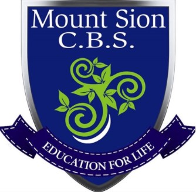

# Mountsion CBS Secondary Website

Mount Sion C.B.S school website, built and maintained by transition year students. This project teaches students the fundamentals of web design and development along with project management following the agile methodology.

## Getting Started

If you wish to contribute to the project take some time to read our [getting started tutorial](./docs/Tutorial.md).

## Built With

* [SemanticUI](https://semantic-ui.com/) 
* [CSS](https://en.wikipedia.org/wiki/Cascading_Style_Sheets)
* [HTMl](https://en.wikipedia.org/wiki/HTML)
* [Github](https://www.github.com)
* [Trello](https://www.trello.com)
* [Slack](https://www.slack.com)
* [Bluejeans](https://www.bluejeans.com)

## Contributors

A list of students from Mount Sion CBS who actively contribute to the project

### Phase 1:
* **Adam Lalor** [Github](https://github.com/AdamLalor)
* **Maciej Marchel** [Github](https://github.com/maciejmarchel12)
* **Dominik Kawka** [Github](https://github.com/dominikkawka)
* **Kieran Hanrahan** [Github](https://github.com/kieranhanrahan)

### Phase 2:
* **Evan Hearne** [Github](https://github.com/evanhearne)
* **Denis Pop** [Github](https://github.com/denispop9)

See also the list of [Contributors](https://github.com/MountSionCBSSecondary/SchoolWebsite/graphs/contributors) who participated in this project.

## Licensed
  
This project is licensed under the MIT License - see the [LICENSE.md](https://github.com/MountSionCBSSecondary/SchoolWebsite/blob/master/LICENCE.md) file for details

## Acknowledgments

From all the students involved we would like to thank all those who helped us with special mention to:

* [Redhat Waterford](https://twitter.com/redhatmobile)
* Mountsion CBS Secondary, Particularly Mr. Kennedy and Mr. Galvin for giving us the time to do the website.